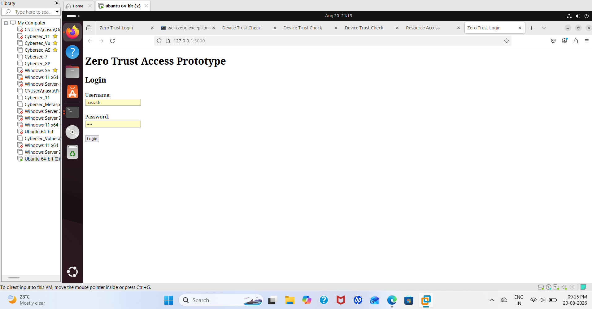
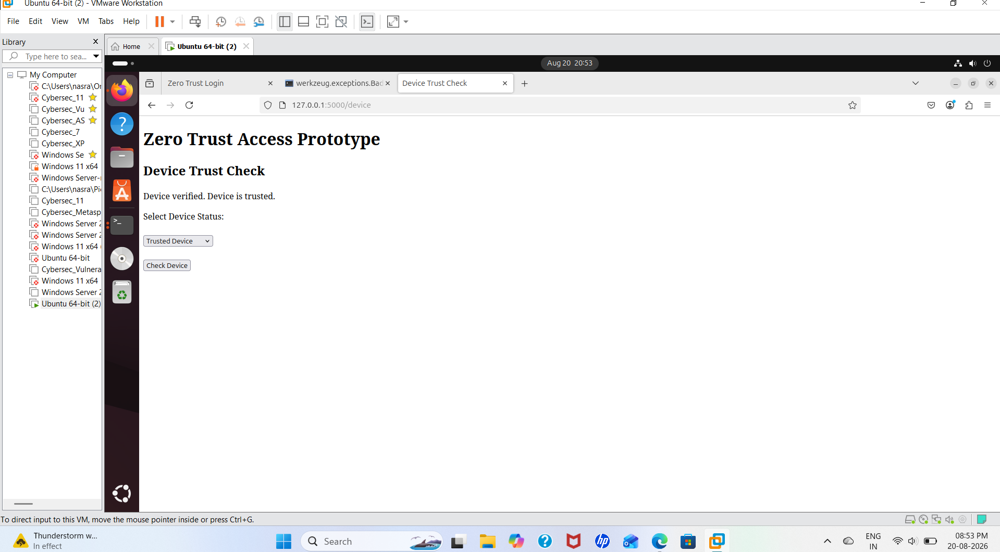
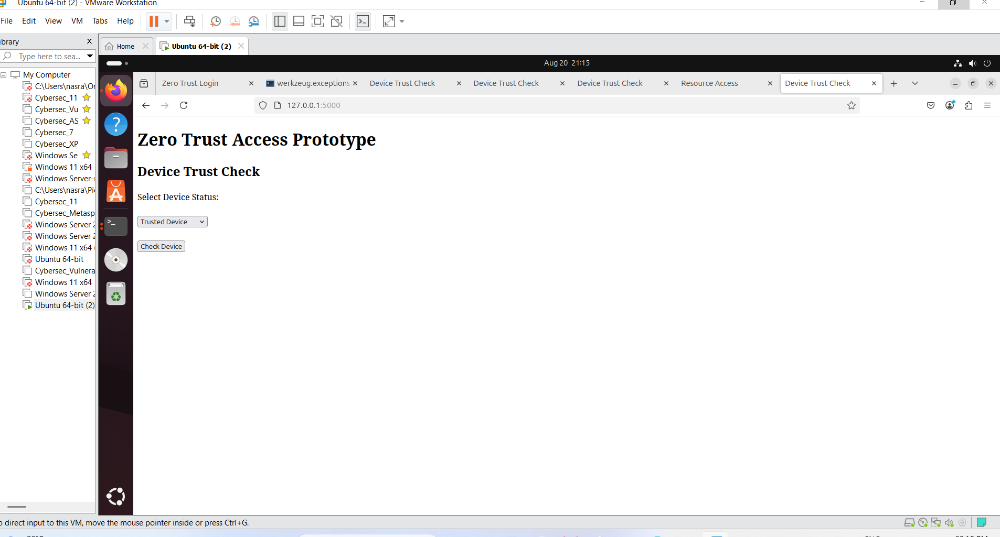
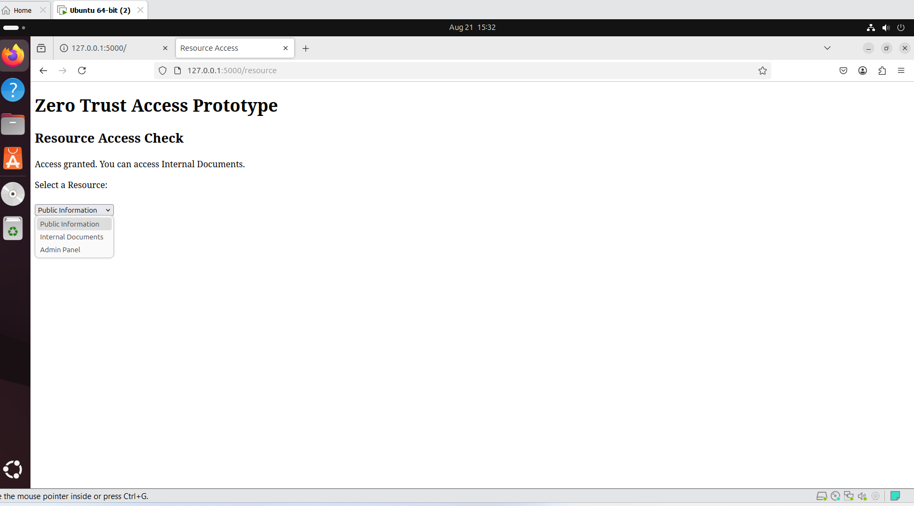
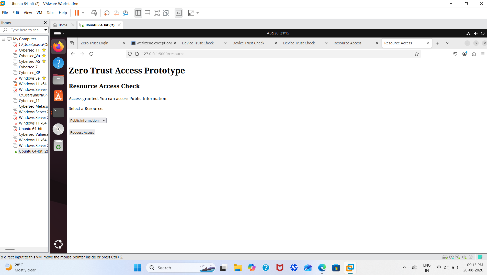
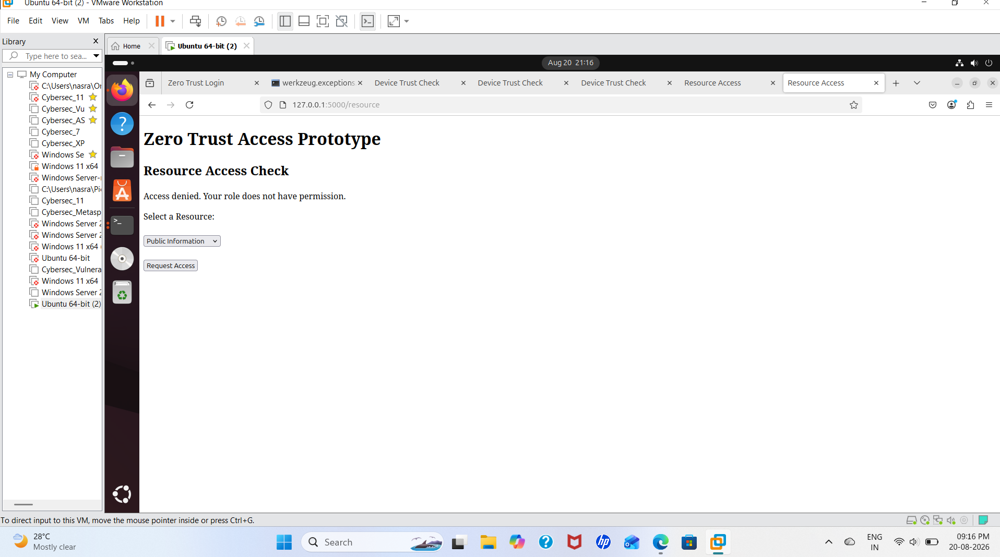
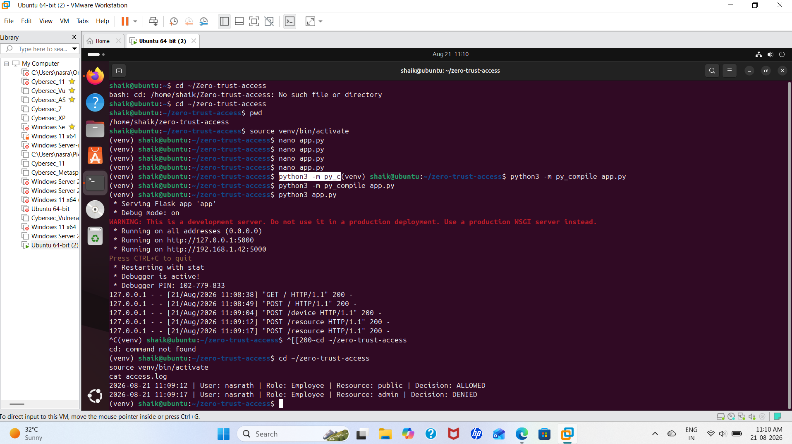
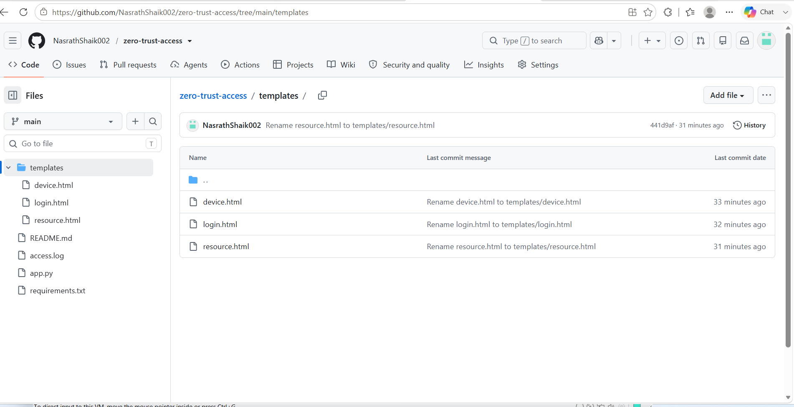

# Zero Trust Access Prototype

## 1. Project Title

**Zero Trust Access Prototype – Enforce Identity, Device, and Resource-Based Access Decisions**

---

# 2. Project Overview

This project is a simple web-based **Zero Trust Access Prototype** developed using **Python and Flask**.

The main purpose of this project is to demonstrate how access can be checked before allowing a user to access a resource.

The application does not trust a user only because the user has successfully logged in.

It checks three main things:

1. **Identity** – Is the username and password correct?
2. **Device** – Is the device trusted?
3. **Resource** – Does the user's role have permission to access the requested resource?

Based on these checks, the application makes an **ALLOW** or **DENY** decision.

The application also records access decisions in an `access.log` file.

---

# 3. Project Objective

The objective of this project is to build a small working prototype that demonstrates the basic idea of Zero Trust access control.

The application follows this process:

```text
User Login
    ↓
Identity Verification
    ↓
Device Trust Verification
    ↓
Resource and Role Verification
    ↓
Access Allowed / Access Denied
    ↓
Access Decision Logged
```

---

# 4. What is Zero Trust?

Zero Trust is a security approach based on the principle:

**"Never trust automatically. Always verify."**

In this project, successful login alone is not enough.

The application also checks the device status and the user's permission for the requested resource.

For example:

* An Employee can access Public Information.
* An Employee can access Internal Documents.
* An Employee cannot access the Admin Panel.
* An Admin can access the Admin Panel.

---

# 5. Technologies Used

* Python 3
* Flask
* HTML
* Ubuntu Linux
* VMware Workstation
* Git
* GitHub

---

# 6. Security Features Implemented

## 6.1 Identity Verification

The application checks the username and password entered by the user.

Demo users used for testing:

| Username | Role     | Password |
| -------- | -------- | -------- |
| nasrath  | Employee | 1234     |
| admin    | Admin    | admin123 |

If the credentials are correct, the user can continue to the next stage.

If the credentials are incorrect, access is denied.

---

## 6.2 Device Trust Verification

After successful login, the application checks the device status.

The user can select:

* Trusted
* Untrusted

A trusted device can continue to the resource access stage.

An untrusted device is denied access.

---

## 6.3 Role-Based Resource Access

The application checks whether the user's role has permission to access the selected resource.

The resources used in this project are:

* Public Information
* Internal Documents
* Admin Panel

### Employee

| Resource           | Decision |
| ------------------ | -------- |
| Public Information | ALLOWED  |
| Internal Documents | ALLOWED  |
| Admin Panel        | DENIED   |

### Admin

| Resource           | Decision |
| ------------------ | -------- |
| Public Information | ALLOWED  |
| Internal Documents | ALLOWED  |
| Admin Panel        | ALLOWED  |

---

## 6.4 Access Logging

The application records resource access decisions in the `access.log` file.

The log records:

* Date and time
* Username
* User role
* Requested resource
* Access decision

Example:

```text
User: nasrath | Role: Employee | Resource: public | Decision: ALLOWED
User: nasrath | Role: Employee | Resource: admin | Decision: DENIED
```

---

# 7. Project Structure

The final repository contains the application source code, HTML templates, documentation, access log, required packages, and screenshots.

```text
zero-trust-access/
│
├── screenshots/
│   ├── 01-login.png
│   ├── 02-successful-login.png
│   ├── 03-device-verification.png
│   ├── 04-resource-page.png
│   ├── 05-access-granted.png
│   ├── 06-access-denied.png
│   ├── 07-access-log.png
│   └── 08-github-repository.png
│
├── templates/
│   ├── device.html
│   ├── login.html
│   └── resource.html
│
├── README.md
├── access.log
├── app.py
└── requirements.txt
```

---

# 8. File Description

## `app.py` – Main Python Program

`app.py` is the main program of the project.

It contains the Python and Flask code that controls the application.

It handles:

* Starting the Flask application
* Login
* Username and password verification
* User roles
* Device verification
* Resource selection
* Access decisions
* Access logging

### In simple words:

**`app.py` is the brain of the project.**

---

## `templates/login.html` – Login Page

`login.html` is the first page shown to the user.

It contains the login form where the user enters:

* Username
* Password

The information is sent to `app.py` for verification.

### In simple words:

**`login.html` is the page where the user enters login details.**

---

## `templates/device.html` – Device Verification Page

`device.html` is used for device verification.

The user selects:

* Trusted
* Untrusted

The selected device status is sent to `app.py`.

### In simple words:

**`device.html` is used to check whether the device is trusted.**

---

## `templates/resource.html` – Resource Access Page

`resource.html` is used when the user requests access to a resource.

Available resources include:

* Public Information
* Internal Documents
* Admin Panel

The request is sent to `app.py`.

### In simple words:

**`resource.html` is where the user requests access to a resource.**

---

## `access.log` – Access Activity Log

`access.log` stores access decisions made by the application.

It records information such as:

* Date and time
* Username
* Role
* Resource
* Decision

### In simple words:

**`access.log` is the activity record of the application.**

---

## `requirements.txt` – Required Python Packages

`requirements.txt` contains the Python packages required to run the application.

Install them using:

```bash
pip install -r requirements.txt
```

### In simple words:

**`requirements.txt` tells us which Python packages are required.**

---

## `README.md` – Project Documentation

`README.md` explains the project.

It contains:

* Project overview
* Objective
* Technologies
* Security features
* File descriptions
* Installation steps
* Testing steps
* Screenshots
* Limitations
* Demonstration flow

### In simple words:

**`README.md` is the project guide.**

---

## `screenshots/` – Project Evidence

The `screenshots` folder contains screenshots taken during testing and demonstration.

```text
screenshots/
├── 01-login.png
├── 02-successful-login.png
├── 03-device-verification.png
├── 04-resource-page.png
├── 05-access-granted.png
├── 06-access-denied.png
├── 07-access-log.png
└── 08-github-repository.png
```

### In simple words:

**The `screenshots` folder contains visual evidence of the project.**

---

# 9. How All Files Work Together

```text
USER
  ↓
login.html
  ↓
app.py
  ↓
Identity Check
  ↓
device.html
  ↓
Device Trust Check
  ↓
resource.html
  ↓
app.py
  ↓
Role + Resource Check
  ↓
ALLOW / DENY
  ↓
access.log
```

---

# 10. Installation and Setup

Open the Ubuntu terminal.

Go to the project directory:

```bash
cd ~/zero-trust-access
```

Check the files:

```bash
ls
```

Create a virtual environment if required:

```bash
python3 -m venv venv
```

Activate it:

```bash
source venv/bin/activate
```

Install the required packages:

```bash
pip install -r requirements.txt
```

Check Flask:

```bash
python -m pip show Flask
```

---

# 11. Run the Application

Go to the project directory:

```bash
cd ~/zero-trust-access
```

Activate the virtual environment:

```bash
source venv/bin/activate
```

Run the application:

```bash
python app.py
```

The application runs on port `5000`.

Open the browser and enter:

```text
http://127.0.0.1:5000
```

---

# 12. Application Testing

The following tests can be used to demonstrate the application.

**Mark a test as PASS only after actually performing it.**

## Test 1 – Valid Employee Login

Username:

```text
nasrath
```

Password:

```text
1234
```

Expected result:

Login should be successful.

**Result: PASS **

---

## Test 2 – Invalid Login

Enter an incorrect username or password.

Expected result:

Access should be denied.

**Result: NOT TESTED**

---

## Test 3 – Trusted Device

Login with valid credentials.

Select:

```text
Trusted
```

Expected result:

User should continue to the resource page.

**Result: PASS**

---

## Test 4 – Untrusted Device

Login with valid credentials.

Select an untrusted device.

Expected result:

Access should be denied.

**Result: PASS**

---

## Test 5 – Employee → Public Information

Login as `nasrath`.

Select:

```text
Public Information
```

Expected result:

```text
ACCESS ALLOWED
```

**Result: PASS**

---

## Test 6 – Employee → Internal Documents

Login as `nasrath`.

Select:

```text
Internal Documents
```

Expected result:

```text
ACCESS ALLOWED
```

**Result: PASS**

---

## Test 7 – Employee → Admin Panel

Login as `nasrath`.

Select:

```text
Admin Panel
```

Expected result:

```text
ACCESS DENIED
```

**Result: PASS**

---

## Test 8 – Admin → Admin Panel

Login as `admin`.

Select:

```text
Admin Panel
```

Expected result:

```text
ACCESS ALLOWED
```

**Result: PASS**

---

## Test 9 – Access Log Verification

Run:

```bash
cat access.log
```

Expected result:

The access decisions should be recorded in the log.

**Result: PASS**

---

# 13. Test Result Summary

| Test                 | Expected Result            | Status            |
| -------------------- | -------------------------- | ----------------- |
| Valid Employee Login | Login successful           | PASS |
| Invalid Login        | Access denied              | PASS / NOT TESTED |
| Trusted Device       | Continue to resource check | PASS  |
| Untrusted Device     | Access denied              | PASS  |
| Employee → Public    | Allowed                    | PASS  |
| Employee → Internal  | Allowed                    | PASS  |
| Employee → Admin     | Denied                     | PASS  |
| Admin → Admin Panel  | Allowed                    | PASS  |
| Access Logging       | Decision recorded          | PASS  |

---

# 14. Screenshots and Evidence

All screenshots are stored inside the `screenshots/` folder.

## Screenshot 1 – Login Page

This screenshot shows the login page.



---

## Screenshot 2 – Successful Login

This screenshot shows successful login using valid credentials.



---

## Screenshot 3 – Device Verification

This screenshot shows the device verification page.



---

## Screenshot 4 – Resource Access Page

This screenshot shows the available resources.



---

## Screenshot 5 – Access Granted

This screenshot shows an access request that was allowed.



---

## Screenshot 6 – Access Denied

This screenshot shows an access request that was denied.



---

## Screenshot 7 – Access Log

This screenshot shows the access decisions recorded in `access.log`.



---

## Screenshot 8 – GitHub Repository

This screenshot shows the final GitHub repository structure.



---

# 15. Security Limitations

This project is a prototype created for learning and demonstration purposes.

The usernames and passwords are demo credentials stored in the application code.

This approach should not be used in a real production environment.

A production application should use:

* Secure password hashing
* Database-based user management
* Multi-factor authentication
* Real device verification
* HTTPS
* Secure session management
* Centralized logging
* Secure secret management
* Strong access control policies

---

# 16. Lab Environment

The project was developed and tested in an isolated Ubuntu virtual machine using VMware Workstation.

Only demo users and synthetic test data were used.

No unauthorized systems or real organizational data were used.

---

# 17. Conclusion

This project demonstrates a basic Zero Trust access control model using Python and Flask.

The application checks:

```text
Identity
   ↓
Device Trust
   ↓
Resource Permission
   ↓
ALLOW / DENY
   ↓
Access Log
```

The prototype demonstrates how access decisions can be made using user identity, device trust status, user role, and requested resource.

---

# 18. Project Demonstration Flow

For the final demonstration:

1. Open the Ubuntu terminal.
2. Go to the project directory.
3. Activate the virtual environment.
4. Start the Flask application.
5. Open `http://127.0.0.1:5000`.
6. Login using the Employee account.
7. Select a trusted device.
8. Access Public Information.
9. Show that access is allowed.
10. Try to access the Admin Panel.
11. Show that access is denied.
12. Login using the Admin account.
13. Access the Admin Panel.
14. Show that access is allowed.
15. Open the terminal.
16. Run:

```bash
cat access.log
```

17. Show the recorded ALLOWED and DENIED decisions.

---

# 19. Final Repository Structure

```text
zero-trust-access/
│
├── screenshots/
│   ├── 01-login.png
│   ├── 02-successful-login.png
│   ├── 03-device-verification.png
│   ├── 04-resource-page.png
│   ├── 05-access-granted.png
│   ├── 06-access-denied.png
│   ├── 07-access-log.png
│   └── 08-github-repository.png
│
├── templates/
│   ├── device.html
│   ├── login.html
│   └── resource.html
│
├── README.md
├── access.log
├── app.py
└── requirements.txt
```

This repository contains the working project source code, documentation, access logs, required dependencies, HTML templates, and screenshots needed for the project demonstration.
